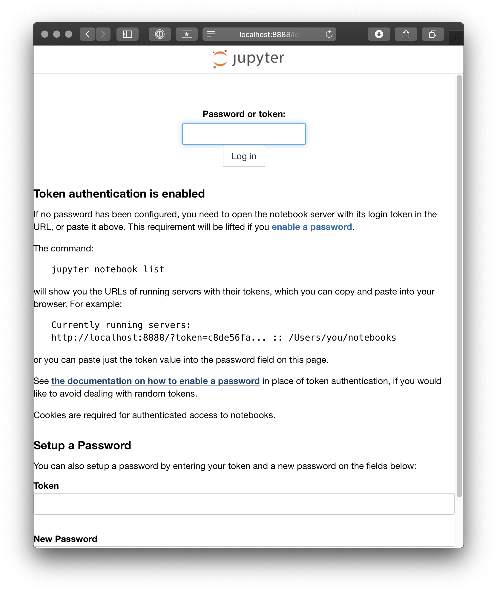
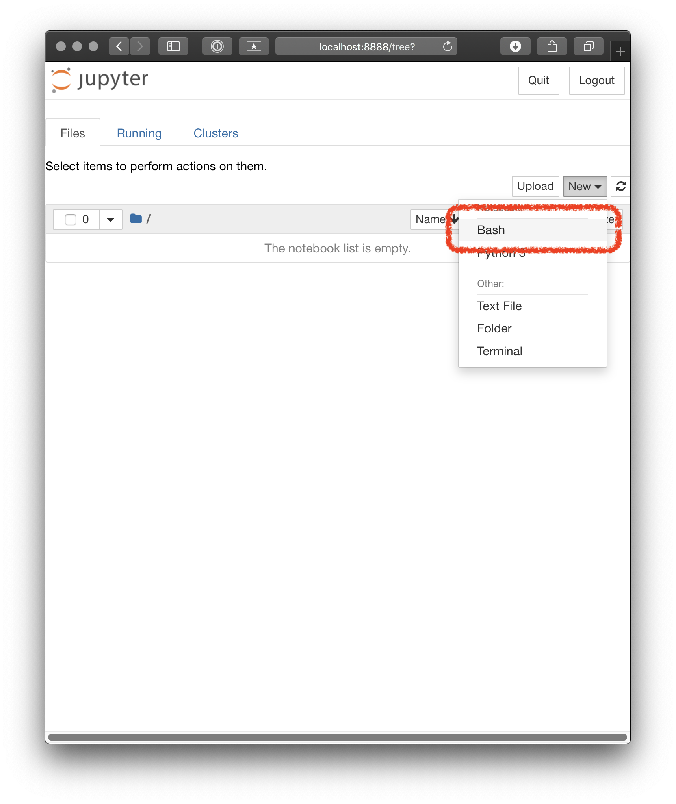
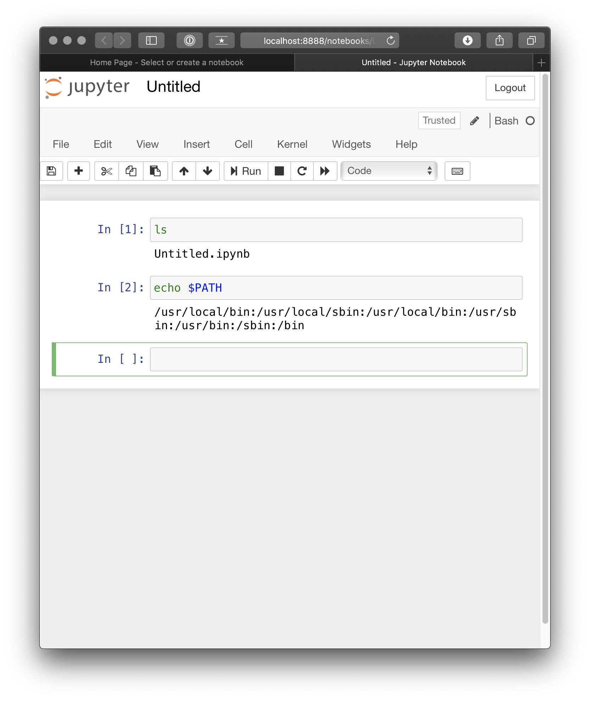

# JupyterNotebook + Bash Kernel 環境

- JupyterNotebook + Bash Kernel 環境の構築方法について
  - Host へ install した場合の起動方法
  - Docker を使用した場合の起動方法
  - docker-compose を使用した場合の起動方法

## 検証環境

- OS
  - `macOS Catalina ver 10.15.2`
- Docker
  - `19.03.5`
- docker-compose
  - `1.25.2`

```bash
$ sw_vers
ProductName:	Mac OS X
ProductVersion:	10.15.2
BuildVersion:	19C57
$ docker -v
Docker version 19.03.5, build 633a0ea
$ docker-compose -v
docker-compose version 1.25.2, build 698e2846
```

## Host へ install した場合の起動方法

- Python3 と pip3 は install 済みとする

```bash
$ which python3
/usr/bin/python3
$ python3 -V
Python 3.7.3
$ which pip3
/usr/local/bin/pip3
$ pip3 -V
pip 19.3.1 from /usr/local/lib/python3.7/site-packages/pip (python 3.7)
```

- JupyterNotebook と Bash Kernel を install する

```bash
$ pip3 install bash_kernel jupyter
$ python3 -m bash_kernel.install
Installing IPython kernel spec
```

- JupyterNotebook を起動する

```bash
$ jupyter notebook
```

- 起動後については、後の項にて述べる

## Docker を使用した場合の起動方法

```bash
$ ls Dockerfile
Dockerfile
$ cat Dockerfile
FROM python:3.6-slim

RUN pip3 install -U pip wheel setuptools && \
    pip3 install \
    bash_kernel \
    jupyter && \
    python3 -m bash_kernel.install

WORKDIR /mount
ENTRYPOINT ["jupyter", "notebook"]
CMD ["--port=8888", "--ip=0.0.0.0", "--allow-root", "--notebook-dir=/mount"]
$ docker build -t jupyter_notebook:latest .
$ docker run --rm -d -v $PWD/mount:/mount -p 8888:8888 jupyter_notebook:latest
$ docker ps
CONTAINER ID        IMAGE                     COMMAND                  CREATED             STATUS              PORTS                    NAMES
f3c255a163cb        jupyter_notebook:latest   "jupyter notebook --…"   15 seconds ago      Up 15 seconds       0.0.0.0:8888->8888/tcp   eager_rosalind
```

- 下のリンクにアクセスする
  - http://localhost:8888



- 上記画面のように Token を聞かれるため、`docker logs` で調べる
  - 下記結果では `882aea42a88f04e448cb55d9e8b56e167fa1b973134c4005`

```bash
$ docker logs f3c255a163cb
[I 15:54:35.331 NotebookApp] Writing notebook server cookie secret to /root/.local/share/jupyter/runtime/notebook_cookie_secret
[I 15:54:35.569 NotebookApp] Serving notebooks from local directory: /mount
[I 15:54:35.569 NotebookApp] The Jupyter Notebook is running at:
[I 15:54:35.569 NotebookApp] http://f3c255a163cb:8888/?token=882aea42a88f04e448cb55d9e8b56e167fa1b973134c4005
[I 15:54:35.569 NotebookApp]  or http://127.0.0.1:8888/?token=882aea42a88f04e448cb55d9e8b56e167fa1b973134c4005
[I 15:54:35.569 NotebookApp] Use Control-C to stop this server and shut down all kernels (twice to skip confirmation).
[W 15:54:35.573 NotebookApp] No web browser found: could not locate runnable browser.
[C 15:54:35.573 NotebookApp]

    To access the notebook, open this file in a browser:
        file:///root/.local/share/jupyter/runtime/nbserver-1-open.html
    Or copy and paste one of these URLs:
        http://f3c255a163cb:8888/?token=882aea42a88f04e448cb55d9e8b56e167fa1b973134c4005
     or http://127.0.0.1:8888/?token=882aea42a88f04e448cb55d9e8b56e167fa1b973134c4005
[W 15:54:39.247 NotebookApp] Clearing invalid/expired login cookie username-localhost-8888
[W 15:54:39.249 NotebookApp] Clearing invalid/expired login cookie username-localhost-8888
[W 15:54:39.249 NotebookApp] Clearing invalid/expired login cookie username-localhost-8888
[I 15:55:45.110 NotebookApp] 302 GET / (172.17.0.1) 1.12ms
[I 15:55:45.136 NotebookApp] 302 GET /tree? (172.17.0.1) 0.64ms
```

- Notebook 起動画面
  - 右上の `[new]` から Bash を選択する
  - Host の `mount` dir が Container 内の `/mount` として mount してある



- Notebook 画面



## docker-compose を使用した場合の起動方法

- 基本的な構成は前項 (Docker を使用した場合の起動方法) と同じ
  - Docker の環境構成 tool である `docker-compose` を使用する

```bash
$ docker-compose up -d --build
```
